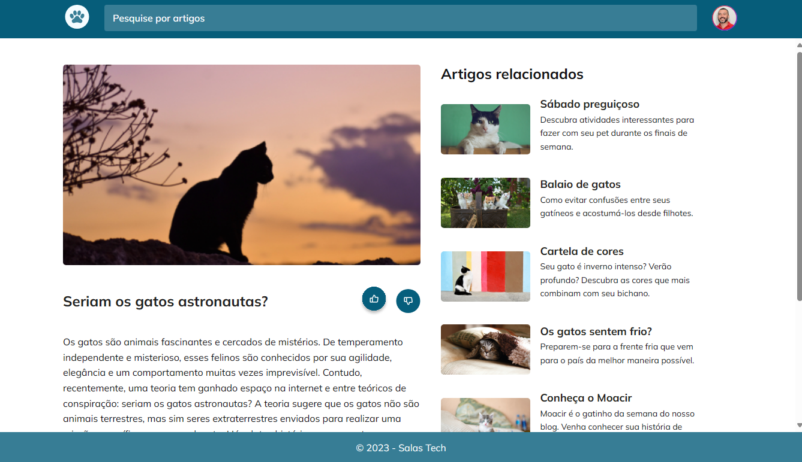

<h1 align="center"> Challenge - Cat's Blog </h1>

The Rocketseat project challenge involves reproducing a Figma project and applying it practically in the project.  

  <a href="#🚀-tecnologias">Technologies</a>&nbsp;&nbsp;&nbsp;|&nbsp;&nbsp;&nbsp;
  <a href="#💻-projeto">Project</a>

  

 

## 🚀 Technologies

This project was developed using the following technologies:

    
    
    
    
    
    

 

## 💻 Project

Putting my studies into practice, I recreated a Figma layout as part of a challenge project by Rocketseat.

